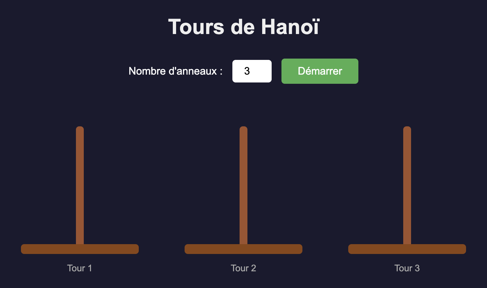
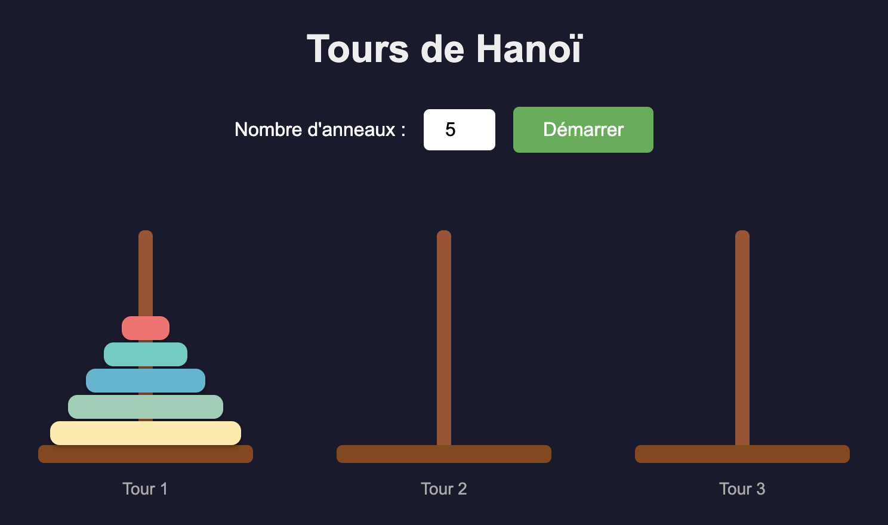
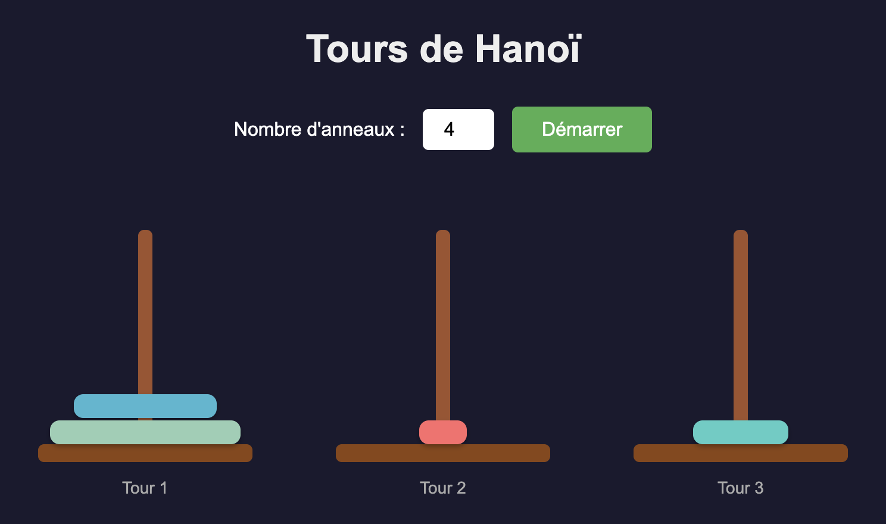
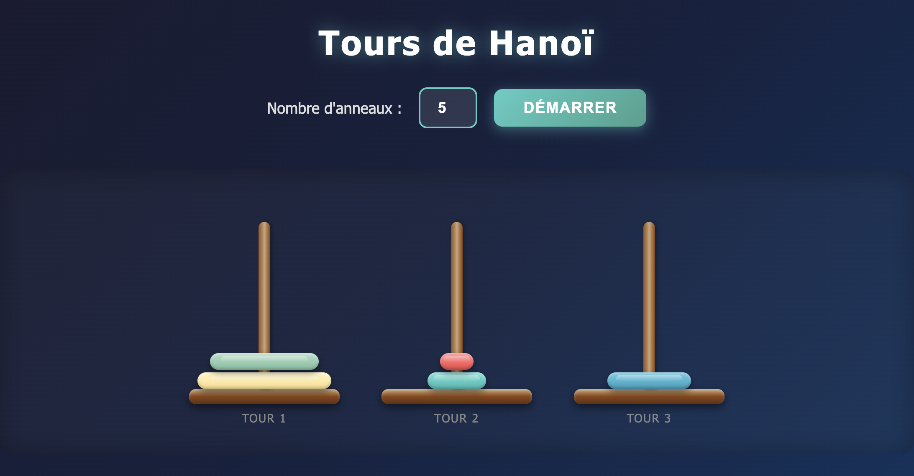
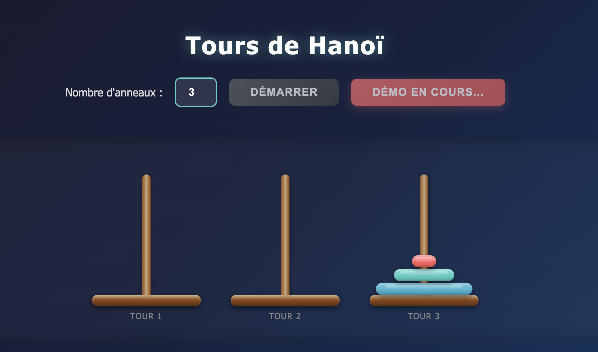

etape 0:
je suis un developeur web , vous etes a la tache de m'aider a effectuer un projet qui est la tour de hanoi ,on avancera etape par etape tout au long du projet, pour chaque etape je te passe un ordre ou bien un prompt , votre reponse se focalise juste sur cett etape en question, n'enchainer pas les prochaines etapes sans mon feu vert

Étape 1 : Page web minimale
cree une page web simple pour le jeu des tours de hanoi avec :

1. Une zone contenant 3 tours représentées visuellement
2. Un bouton "Démarrer"
3. Un input de type numerique pour choisir le nombre d'anneaux avec une limite maximum de nombre d'anneaux
4. Utilise HTML, CSS et JavaScript vanilla

Étape 2 : Génération dynamique des anneaux
Ajoute la fonctionnalité suivante :
Quand on clique sur le bouton "Démarrer", génère dynamiquement le nombre d'anneaux choisi sur la première tour.

- Les anneaux doivent etre empilés
- Plus l'anneau est grand, plus il est bas dans la pile
- Chaque anneau doit avoir une largeur corespondante à sa taille
- Les anneaux doivent être centrés sur la tour
  

Étape 3 — Déplacement des anneaux
Ajoute la logique de déplacement :
1. Quand on clique sur un anneau, il est "sélectionné"
2. Quand on clique sur une tour, l'anneau sélectionné y est déplacé
3. Respecte la règle : un anneau ne peut être placé que sur un anneau plus grand
4. Si le mouvement est invalide, annule la sélection
5. Affiche un effet visuel pour la sélection

Étape 4 : Améliorations visuelles
Améliore l'interface visuelle :
1. Ajoute des couleurs aux anneaux (dégradé ou palette)
2. Anime les déplacements (transition CSS)
3. Améliore la mise en page (centrage, espacement)
4. Ajoute un style aux tours (base, couleur)
5. Rend le design responsive

Étape 5 — Ajout d’un mode "Démo automaique"
Ajoute un bouton "Démo automatique" qui résout le jeu automatiquement avec l'algorithme récursif des Tours de Hanoï.
- L'algorithme doit être visible (pas instantané)
- Chaque mouvement doit être animé
- Utilise la fonction récursive classique
- Affiche un message quand la démo est terminée

Étape 6 — Extensions obligatoires
Ajoute les fonctionnalités suivantes :
1. Compteur de coups (affiche les coups manuels et automatiques)
2. Détection de victoire + message de félicitations quand tous les anneaux sont sur la dernière tour
3. Système de score basé sur le nombre minimal de coups (2^n - 1)
4. Bouton "Reset" qui remet le jeu à l'état initial
5. Animations fluides pour les déplacements 
6. Bouton pour basculer entre mode sombre et mode clair

